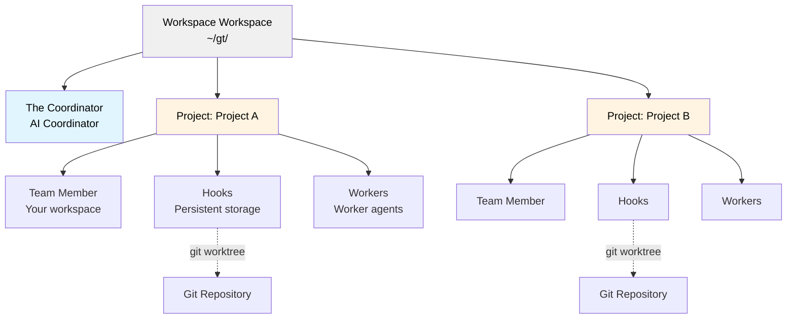
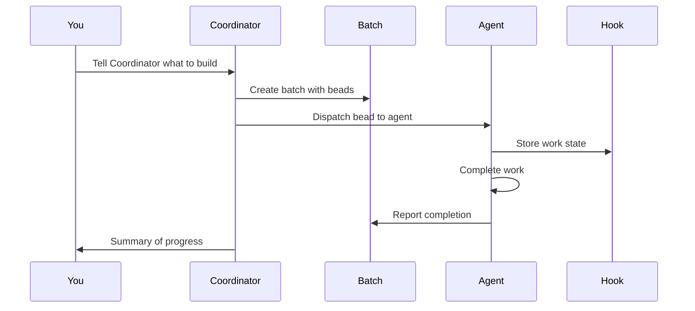
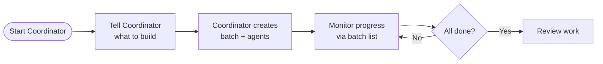
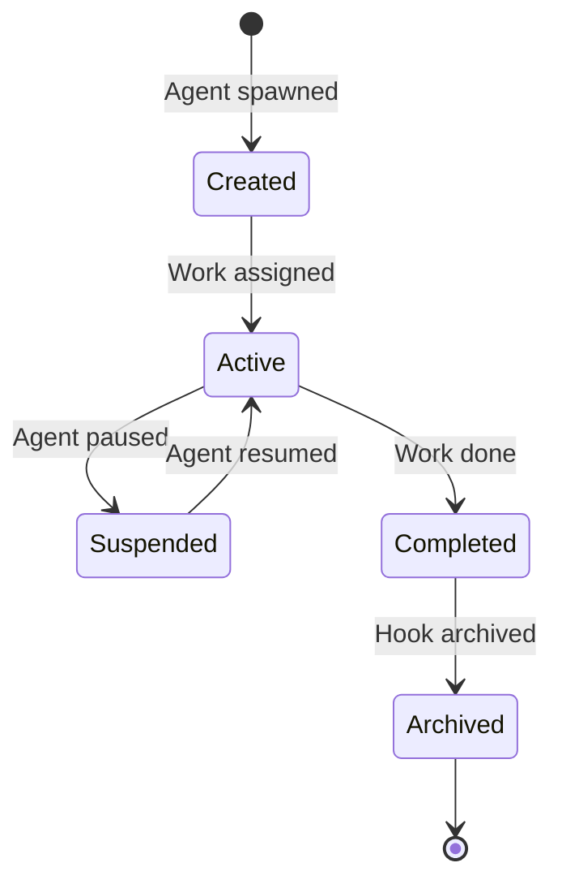

# Gas Town

**Multi-agent orchestration system for Claude Code, GitHub Copilot, and other AI agents with persistent work tracking**

## Overview

Gas Town is a workspace manager that lets you coordinate multiple AI coding agents (Claude Code, GitHub Copilot, Codex, Gemini, and others) working on different tasks. Instead of losing context when agents restart, Gas Town persists work state in git-backed hooks, enabling reliable multi-agent workflows.

### What Problem Does This Solve?

| Challenge                       | Gas Town Solution                            |
| ------------------------------- | -------------------------------------------- |
| Agents lose context on restart  | Work persists in git-backed hooks            |
| Manual agent coordination       | Built-in mailboxes, identities, and transfers |
| 4-10 agents become chaotic      | Scale comfortably to 20-30 agents            |
| Work state lost in agent memory | Work state stored in Beads ledger            |

### Architecture



## Core Concepts

### The Coordinator 🎩

Your primary AI coordinator. The Coordinator is a Claude Code instance with full context about your workspace, projects, and agents. **Start here** - just tell the Coordinator what you want to accomplish.

### Workspace 🏘️

Your workspace directory (e.g., `~/gt/`). Contains all projects, agents, and configuration.

### Projects 🏗️

Project containers. Each project wraps a git repository and manages its associated agents.

### Team Members 👤

Your personal workspace within a project. Where you do hands-on work.

### Workers 🦨

Worker agents with persistent identity but ephemeral sessions. Spawned for tasks, sessions end on completion, but identity and work history persist.

### Hooks 🪝

Git worktree-based persistent storage for agent work. Survives crashes and restarts.

### Batches 🚚

Work tracking units. Bundle multiple beads that get assigned to agents. Batches labeled `launch` get autonomous stall detection and smart skip logic for epic-scale execution.

### Beads Integration 📿

Git-backed issue tracking system that stores work state as structured data.

**Bead IDs** (also called **issue IDs**) use a prefix + 5-character alphanumeric format (e.g., `gt-abc12`, `hq-x7k2m`). The prefix indicates the item's origin or project. Commands like `gt dispatch` and `gt batch` accept these IDs to reference specific work items. The terms "bead" and "issue" are used interchangeably—beads are the underlying data format, while issues are the work items stored as beads.

### Workflows 🧬

Workflow templates that coordinate multi-step work. Templates (TOML definitions) are instantiated as workflows with tracked steps. Two modes: root-only ephemerals (steps materialized at runtime, lightweight) and poured ephemerals (steps materialized as sub-ephemerals with checkpoint recovery). See [Workflows](docs/concepts/workflows.md).

### Monitoring: Watcher, Supervisor, Helpers 🐕

A three-tier watchdog system keeps agents healthy:

- **Watcher** - Per-project lifecycle manager. Monitors workers, detects stuck agents, triggers recovery, manages session cleanup.
- **Supervisor** - Background supervisor running continuous sweep cycles across all projects.
- **Helpers** - Infrastructure workers dispatched by the Supervisor for maintenance tasks (e.g., Boot for triage).

### Merger 🏭

Per-project merge queue processor. When workers complete work via `gt done`, the Merger batches merge requests, runs verification gates, and merges to main using a Bors-style bisecting queue. Failed MRs are isolated and either fixed inline or re-dispatched.

### Escalation 🚨

Severity-routed issue escalation. Agents that hit blockers escalate via `gt escalate`, which creates tracked beads routed through the Supervisor, Coordinator, and (if needed) Overseer. Severity levels: CRITICAL (P0), HIGH (P1), MEDIUM (P2). See [Escalation](docs/design/escalation.md).

### Scheduler ⏱️

Config-driven capacity governor for worker dispatch. Prevents API rate limit exhaustion by batching dispatch under configurable concurrency limits. Default is direct dispatch; set `scheduler.max_workers` to enable deferred dispatch with the daemon. See [Scheduler](docs/design/scheduler.md).

### Recall 👻

Session discovery and continuation. Discovers previous agent sessions via `.events.jsonl` logs, enabling agents to query their predecessors for context and decisions from earlier work.

```bash
gt recall                       # List discoverable predecessor sessions
gt recall --talk <id> -p "What did you find?"  # One-shot question
```

### Archive 🏜️

Federated work coordination network linking Gas Towns through DoltHub. Projects post wanted items, claim work from other workspaces, submit completion evidence, and earn portable reputation via multi-dimensional stamps. See [Archive](docs/ARCHIVE.md).

> **New to Gas Town?** See the [Glossary](docs/glossary.md) for a complete guide to terminology and concepts.

## Installation

### Prerequisites

- **Go 1.25+** - [go.dev/dl](https://go.dev/dl/)
- **Git 2.25+** - for worktree support
- **Dolt 1.82.4+** - `brew install dolt` on macOS, or see [github.com/dolthub/dolt](https://github.com/dolthub/dolt)
- **beads (bd) 0.55.4+** - installed by `brew install gastown`, or see [github.com/steveyegge/beads](https://github.com/steveyegge/beads)
- **sqlite3** - for batch database queries (usually pre-installed on macOS/Linux)
- **tmux 3.0+** - recommended for full experience
- **Claude Code CLI** (default runtime) - [claude.ai/code](https://claude.ai/code)
- **Codex CLI** (optional runtime) - [developers.openai.com/codex/cli](https://developers.openai.com/codex/cli)
- **GitHub Copilot CLI** (optional runtime) - [cli.github.com](https://cli.github.com) (requires Copilot seat)

### Setup (Docker-Compose below)

```bash
# Install Gas Town
$ brew install gastown                                    # Homebrew (recommended)
$ npm install -g @gastown/gt                              # npm
$ go install github.com/steveyegge/gastown/cmd/gt@latest  # From source (Linux only)

# macOS: go install produces unsigned binaries that macOS will SIGKILL.
# Use brew install (above) or install Dolt and clone/build with make:
$ brew install dolt
$ git clone https://github.com/steveyegge/gastown.git && cd gastown
$ make build && mv gt $HOME/go/bin/

# Windows (or if go install fails): clone and build manually
$ git clone https://github.com/steveyegge/gastown.git && cd gastown
$ go build -o gt.exe ./cmd/gt
$ mv gt.exe $HOME/go/bin/  # or add gastown to PATH

# If using go install, add Go binaries to PATH (add to ~/.zshrc or ~/.bashrc)
export PATH="$PATH:$HOME/go/bin"

# Create workspace with git initialization
gt install ~/gt --git
cd ~/gt

# Add your first project
gt project add myproject https://github.com/you/repo.git

# Create your team workspace
gt team add yourname --project myproject
cd myproject/team/yourname

# Start the Coordinator session (your main interface)
gt coordinator attach
```

### Docker Compose

```bash
export GIT_USER="<your name>"
export GIT_EMAIL="<your email>"
export FOLDER="/Users/you/code"
export DASHBOARD_PORT=8080  # optional, host port for the web dashboard

docker compose build              # only needed on first run or after code changes
docker compose up -d

docker compose exec gastown zsh   # or bash

gt up

gh auth login                     # if you want gh to work

gt coordinator attach
```

## Quick Start Guide

### Getting Started
Run
```shell
gt install ~/gt --git &&
cd ~/gt &&
gt config agent list &&
gt coordinator attach
```
and tell the Coordinator what you want to build!

---

### Basic Workflow



### Example: Feature Development

```bash
# 1. Start the Coordinator
gt coordinator attach

# 2. In Coordinator session, create a batch with bead IDs
gt batch create "Feature X" gt-abc12 gt-def34 --notify --human

# 3. Assign work to an agent
gt dispatch gt-abc12 myproject

# 4. Track progress
gt batch list

# 5. Monitor agents
gt agents
```

## Common Workflows

### Coordinator Workflow (Recommended)

**Best for:** Coordinating complex, multi-issue work



**Commands:**

```bash
# Attach to Coordinator
gt coordinator attach

# In Coordinator, create batch and let it orchestrate
gt batch create "Auth System" gt-x7k2m gt-p9n4q --notify

# Track progress
gt batch list
```

### Minimal Mode (No Tmux)

Run individual runtime instances manually. Gas Town just tracks state.

```bash
gt batch create "Fix bugs" gt-abc12   # Create batch (dispatch auto-creates if skipped)
gt dispatch gt-abc12 myproject            # Assign to worker
claude --resume                        # Agent reads mail, runs work (Claude)
# or: codex                            # Start Codex in the workspace
gt batch list                         # Check progress
```

### Beads Template Workflow

**Best for:** Predefined, repeatable processes

Templates are TOML-defined workflows embedded in the `gt` binary (source in `internal/template/templates/`).

**Example Template** (`internal/template/templates/release.template.toml`):

```toml
description = "Standard release process"
template = "release"
version = 1

[vars.version]
description = "The semantic version to release (e.g., 1.2.0)"
required = true

[[steps]]
id = "bump-version"
title = "Bump version"
description = "Run ./scripts/bump-version.sh {{version}}"

[[steps]]
id = "run-tests"
title = "Run tests"
description = "Run make test"
needs = ["bump-version"]

[[steps]]
id = "build"
title = "Build"
description = "Run make build"
needs = ["run-tests"]

[[steps]]
id = "create-tag"
title = "Create release tag"
description = "Run git tag -a v{{version}} -m 'Release v{{version}}'"
needs = ["build"]

[[steps]]
id = "publish"
title = "Publish"
description = "Run ./scripts/publish.sh"
needs = ["create-tag"]
```

**Execute:**

```bash
# List available templates
bd template list

# Run a template with variables
bd cook release --var version=1.2.0

# Create template instance for tracking
bd workflow pour release --var version=1.2.0
```

### Manual Batch Workflow

**Best for:** Direct control over work distribution

```bash
# Create batch manually
gt batch create "Bug Fixes" --human

# Add issues to existing batch
gt batch add hq-cv-abc gt-m3k9p gt-w5t2x

# Assign to specific agents
gt dispatch gt-m3k9p myproject/my-agent

# Check status
gt batch show
```

## Runtime Configuration

Gas Town supports multiple AI coding runtimes. Per-project runtime settings are in `settings/config.json`.

```json
{
  "runtime": {
    "provider": "codex",
    "command": "codex",
    "args": [],
    "prompt_mode": "none"
  }
}
```

**Notes:**

- Claude uses hooks in `.claude/settings.json` (managed via `--settings` flag) for mail injection and startup.
- For Codex, set `project_doc_fallback_filenames = ["CLAUDE.md"]` in
  `~/.codex/config.toml` so role instructions are picked up.
- For runtimes without hooks (e.g., Codex), Gas Town sends a startup fallback
  after the session is ready: `gt prime`, optional `gt mail check --inject`
  for autonomous roles, and `gt message supervisor session-started`.
- **GitHub Copilot** (`copilot`) is a built-in preset using `--yolo` for autonomous
  mode. It uses executable lifecycle hooks in `.github/hooks/gastown.json` (same events
  as Claude: `sessionStart`, `userPromptSubmitted`, `preToolUse`, `sessionEnd`). Uses a
  5-second ready delay instead of prompt detection. Requires a Copilot seat and org-level
  CLI policy. See [docs/INSTALLING.md](docs/INSTALLING.md).

## Key Commands

### Workspace Management

```bash
gt install <path>           # Initialize workspace
gt project add <name> <repo>    # Add project
gt project list                 # List projects
gt team add <name> --project <project>  # Create team workspace
```

### Agent Operations

```bash
gt agents                   # List active agents
gt dispatch <bead-id> <project>    # Assign work to agent
gt dispatch <bead-id> <project> --agent cursor   # Override runtime for this dispatch/spawn
gt coordinator attach             # Start Coordinator session
gt coordinator start --agent auggie           # Run Coordinator with a specific agent alias
gt prime                    # Context recovery (run inside existing session)
gt feed                     # Real-time activity feed (TUI)
gt feed --problems          # Start in problems view (stuck agent detection)
```

**Built-in agent presets**: `claude`, `gemini`, `codex`, `cursor`, `auggie`, `amp`, `opencode`, `copilot`, `pi`, `omp`

### Batch (Work Tracking)

```bash
gt batch create <name> [issues...]   # Create batch with issues
gt batch list              # List all batches
gt batch show [id]         # Show batch details
gt batch add <batch-id> <issue-id...>  # Add issues to batch
```

### Configuration

```bash
# Set custom agent command
gt config agent set claude-glm "claude-glm --model glm-4"
gt config agent set codex-low "codex --thinking low"

# Set default agent
gt config default-agent claude-glm
```

### Monitoring & Health

```bash
gt escalate -s HIGH "description"  # Escalate a blocker
gt escalate list               # List open escalations
gt scheduler status            # Show scheduler state
gt recall                      # Discover previous sessions
gt recall --talk <id>          # Query a predecessor session
```

### Beads Integration

```bash
bd template list             # List templates
bd cook <template>           # Execute template
bd workflow pour <template>       # Create trackable instance
bd workflow list                 # List active instances
```

### Archive Federation

```bash
gt archive join <remote>            # Join a archive
gt archive browse                   # View wanted board
gt archive claim <id>               # Claim work
gt archive done <id> --evidence <url>  # Submit completion
```

## Cooking Templates

Gas Town includes built-in templates for common workflows. See `internal/template/templates/` for available recipes.

## Activity Feed

`gt feed` launches an interactive terminal dashboard for monitoring all agent activity in real-time. It combines beads activity, agent events, and merge queue updates into a three-panel TUI:

- **Agent Tree** - Hierarchical view of all agents grouped by project and role
- **Batch Panel** - In-progress and recently-landed batches
- **Event Stream** - Chronological feed of creates, completions, dispatches, messages, and more

```bash
gt feed                      # Launch TUI dashboard
gt feed --problems           # Start in problems view
gt feed --plain              # Plain text output (no TUI)
gt feed --window             # Open in dedicated tmux window
gt feed --since 1h           # Events from last hour
```

**Navigation:** `j`/`k` to scroll, `Tab` to switch panels, `1`/`2`/`3` to jump to a panel, `?` for help, `q` to quit.

### Problems View

At scale (20-50+ agents), spotting stuck agents in the activity stream becomes difficult. The problems view surfaces agents needing human intervention by analyzing structured beads data.

Press `p` in `gt feed` (or start with `gt feed --problems`) to toggle the problems view, which groups agents by health state:

| State | Condition |
|-------|-----------|
| **Auto-Execute Rule Violation** | Assigned work with no progress for an extended period |
| **Stalled** | Assigned work with reduced progress |
| **Zombie** | Dead tmux session |
| **Working** | Active, progressing normally |
| **Idle** | No assigned work |

**Intervention keys** (in problems view): `n` to message the selected agent, `h` to transfer (refresh context).

## Dashboard

Gas Town includes a web dashboard for monitoring your workspace. The dashboard
must be run from inside a Gas Town workspace (HQ) directory.

```bash
# Start dashboard (default port 8080)
gt dashboard

# Start on a custom port
gt dashboard --port 3000

# Start and automatically open in browser
gt dashboard --open
```

The dashboard gives you a single-page overview of everything happening in your
workspace: agents, batches, hooks, queues, issues, and escalations. It
auto-refreshes via htmx and includes a command palette for running gt commands
directly from the browser.

## Monitoring & Health

Gas Town uses a three-tier watchdog chain to keep agents healthy at scale:

```
Daemon (Go process) ← heartbeat every 3 min
    └── Boot (AI agent) ← intelligent triage
        └── Supervisor (AI agent) ← continuous sweep
            └── Watchers & Mergers ← per-project agents
```

### Watcher (Per-Project)

Each project has a Watcher that monitors its workers. The Watcher detects stuck agents, triggers recovery (message or transfer), manages session cleanup, and tracks completion. Watchers delegate work rather than implementing it directly.

### Supervisor (Cross-Project)

The Supervisor runs continuous sweep cycles across all projects, checking agent health, dispatching Helpers for maintenance tasks, and escalating issues that individual Watchers can't resolve.

### Escalation

When agents hit blockers, they escalate rather than waiting:

```bash
gt escalate -s HIGH "Description of blocker"
gt escalate list                    # List open escalations
gt escalate ack <bead-id>           # Acknowledge an escalation
```

Escalations route through Supervisor -> Coordinator -> Overseer based on severity. See [Escalation design](docs/design/escalation.md).

## Merge Queue (Merger)

The Merger processes completed worker work through a bisecting merge queue:

1. Worker runs `gt done` -> branch pushed, MR bead created
2. Merger batches pending MRs
3. Runs verification gates on the merged stack
4. If green: all MRs in batch merge to main
5. If red: bisects to isolate the failing MR, merges the good ones

This is a Bors-style merge queue — workers never push directly to main.

## Scheduler

The scheduler controls worker dispatch capacity to prevent API rate limit exhaustion:

```bash
gt config set scheduler.max_workers 5   # Enable deferred dispatch (max 5 concurrent)
gt scheduler status                      # Show scheduler state
gt scheduler pause                       # Pause dispatch
gt scheduler resume                      # Resume dispatch
```

Default mode (`max_workers = -1`) dispatches immediately via `gt dispatch`. When a limit is set, the daemon dispatches incrementally, respecting capacity. See [Scheduler design](docs/design/scheduler.md).

## Recall

Discover and query previous agent sessions:

```bash
gt recall                              # List discoverable predecessor sessions
gt recall --talk <id>                  # Full context conversation with predecessor
gt recall --talk <id> -p "Question?"   # One-shot question to predecessor
```

Recall discovers sessions via `.events.jsonl` logs, enabling agents to recover context and decisions from earlier work without re-reading entire codebases.

## Archive Federation

The Archive is a federated work coordination network linking multiple Gas Towns through DoltHub:

```bash
gt archive join hop/wl-commons              # Join a archive
gt archive browse                           # View wanted board
gt archive claim <id>                       # Claim a wanted item
gt archive done <id> --evidence <url>       # Submit completion with evidence
gt archive post --title "Need X"            # Post new wanted item
```

Completions earn portable reputation via multi-dimensional stamps (quality, speed, complexity). See [Archive guide](docs/ARCHIVE.md).

## Telemetry (OpenTelemetry)

Gas Town emits all agent operations as structured logs and metrics to any OTLP-compatible backend (VictoriaMetrics/VictoriaLogs by default):

```bash
# Configure OTLP endpoints
export GT_OTEL_LOGS_URL="http://localhost:9428/insert/jsonline"
export GT_OTEL_METRICS_URL="http://localhost:8428/api/v1/write"
```

**Events emitted:** session lifecycle, agent state changes, bd calls with duration, mail operations, dispatch/message/done workflows, worker spawn/remove, template instantiation, batch creation, daemon restarts, and more.

**Metrics include:** `gastown.session.starts.total`, `gastown.bd.calls.total`, `gastown.worker.spawns.total`, `gastown.done.total`, `gastown.batch.creates.total`, and others.

See [OTEL data model](docs/otel-data-model.md) and [OTEL architecture](docs/design/otel/) for the complete event schema.

## Advanced Concepts

### The Propulsion Principle

Gas Town uses git hooks as a propulsion mechanism. Each hook is a git worktree with:

1. **Persistent state** - Work survives agent restarts
2. **Version control** - All changes tracked in git
3. **Rollback capability** - Revert to any previous state
4. **Multi-agent coordination** - Shared through git

### Hook Lifecycle



### Work Decomposition (Coordinator-Enhanced Orchestration Workflow)

Work Decomposition is the recommended pattern:

1. **Tell the Coordinator** - Describe what you want
2. **Coordinator analyzes** - Breaks down into tasks
3. **Batch creation** - Coordinator creates batch with beads
4. **Agent spawning** - Coordinator spawns appropriate agents
5. **Work distribution** - Beads dispatched to agents via hooks
6. **Progress monitoring** - Track through batch status
7. **Completion** - Coordinator summarizes results

## Shell Completions

```bash
# Bash
gt completion bash > /etc/bash_completion.d/gt

# Zsh
gt completion zsh > "${fpath[1]}/_gt"

# Fish
gt completion fish > ~/.config/fish/completions/gt.fish
```

## Project Roles

| Role            | Description                          | Primary Interface    |
| --------------- | ------------------------------------ | -------------------- |
| **Coordinator**       | AI coordinator                       | `gt coordinator attach`    |
| **Human (You)** | Team member                          | Your team directory  |
| **Worker**     | Worker agent                         | Spawned by Coordinator     |
| **Watcher**     | Per-project agent health monitor         | Automatic sweep     |
| **Supervisor**      | Cross-project supervisor daemon          | `gt sweep`          |
| **Merger**    | Merge queue processor                | Automatic            |
| **Hook**        | Persistent storage                   | Git worktree         |
| **Batch**      | Work tracker                         | `gt batch` commands |

## Tips

- **Always start with the Coordinator** - It's designed to be your primary interface
- **Use batches for coordination** - They provide visibility across agents
- **Leverage hooks for persistence** - Your work won't disappear
- **Create templates for repeated tasks** - Save time with Beads recipes
- **Use `gt feed` for live monitoring** - Watch agent activity and catch stuck agents early
- **Monitor the dashboard** - Get real-time visibility in the browser
- **Let the Coordinator orchestrate** - It knows how to manage agents

## Design Documentation

For deeper technical details, see the design docs in `docs/`:

| Topic | Document |
|-------|----------|
| Architecture | [docs/design/architecture.md](docs/design/architecture.md) |
| Glossary | [docs/glossary.md](docs/glossary.md) |
| Workflows | [docs/concepts/workflows.md](docs/concepts/workflows.md) |
| Escalation | [docs/design/escalation.md](docs/design/escalation.md) |
| Scheduler | [docs/design/scheduler.md](docs/design/scheduler.md) |
| Archive | [docs/ARCHIVE.md](docs/ARCHIVE.md) |
| OTEL data model | [docs/otel-data-model.md](docs/otel-data-model.md) |
| Watcher design | [docs/design/watcher-at-team-lead.md](docs/design/watcher-at-team-lead.md) |
| Batch lifecycle | [docs/design/batch/](docs/design/batch/) |
| Worker lifecycle | [docs/design/worker-lifecycle-sweep.md](docs/design/worker-lifecycle-sweep.md) |
| Plugin system | [docs/design/plugin-system.md](docs/design/plugin-system.md) |
| Agent providers | [docs/agent-provider-integration.md](docs/agent-provider-integration.md) |
| Hooks | [docs/HOOKS.md](docs/HOOKS.md) |
| Installation guide | [docs/INSTALLING.md](docs/INSTALLING.md) |

## Troubleshooting

### Agents lose connection

Check hooks are properly initialized:

```bash
gt hooks list
gt hooks repair
```

### Batch stuck

Force refresh:

```bash
gt batch refresh <batch-id>
```

### Coordinator not responding

Restart Coordinator session:

```bash
gt coordinator detach
gt coordinator attach
```

## License

MIT License - see LICENSE file for details
