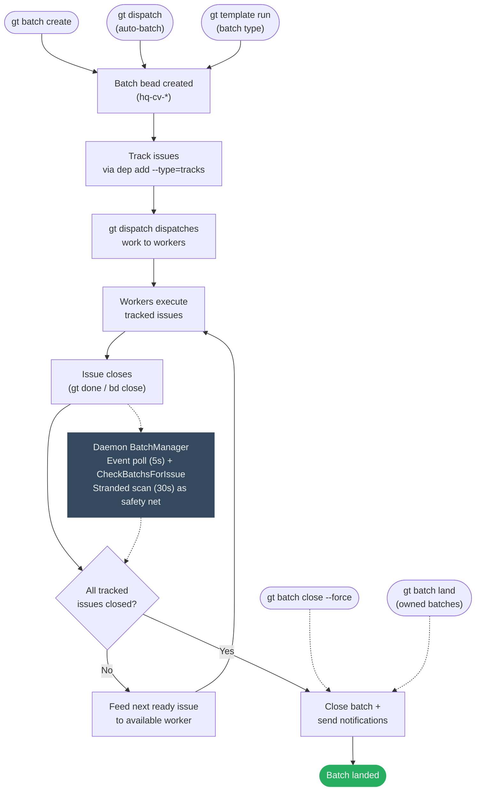
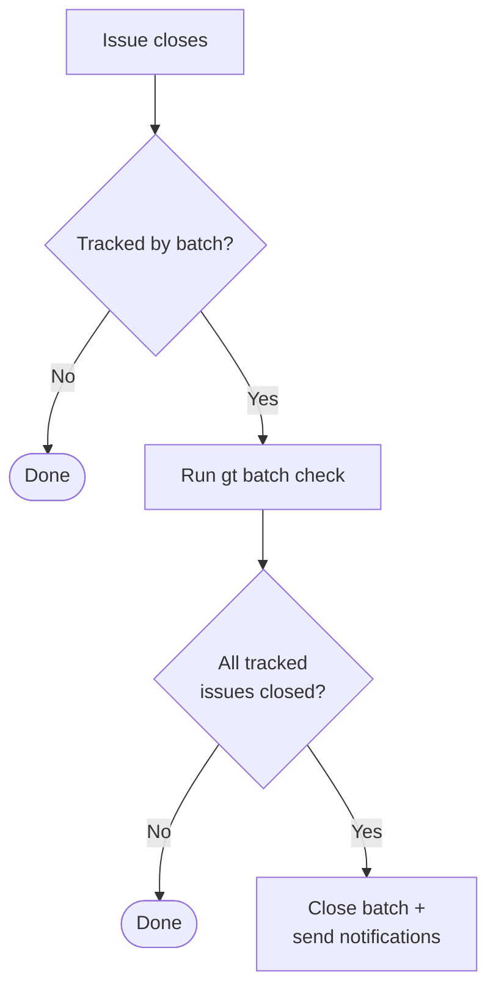

# Batch Lifecycle Design

> Making batches actively converge on completion.

## Flow



Three creation paths feed into the same lifecycle. Completion is event-driven
via the daemon's `BatchManager`, which runs two goroutines:

- **Event poll** (every 5s): Polls all project beads stores + hq via
  `GetAllEventsSince`, detects close events, and calls
  `batch.CheckBatchsForIssue` — which both checks completion *and* feeds
  the next ready issue to a worker.
- **Stranded scan** (every 30s): Runs `gt batch stranded --json` to catch
  batches missed by the event-driven path (e.g. after crash/restart). Feeds
  ready work or auto-closes empty batches.

Manual overrides (`close --force`, `land`) bypass the check entirely.

> **History**: Watcher and Merger observers were originally planned as
> redundant observers but were removed (spec S-04, S-05). The daemon's
> multi-project event poll + stranded scan provide sufficient coverage.

---

## Auto-batch creation: what `gt dispatch` actually does

`gt dispatch` auto-creates a batch for every bead it dispatches, unless
`--no-batch` is passed. The behavior differs significantly between
single-bead and multi-bead (batch) dispatch.

### Single-bead dispatch

```
gt dispatch sh-task-1 gastown
```

1. Checks if `sh-task-1` is already tracked by an open batch.
2. If not tracked: creates one auto-batch `"Work: <issue-title>"` tracking
   that single bead.
3. Spawns one worker, hooks the bead, starts working.

Result: 1 bead, 1 batch, 1 worker.

### Batch dispatch (3+ args, project auto-resolved)

```
gt dispatch gt-task-1 gt-task-2 gt-task-3
```

The project is auto-resolved from the beads' prefixes via `routes.jsonl`
(`resolveRigFromBeadIDs` in `dispatch_batch.go`). All beads must resolve
to the same project. An explicit project arg still works but prints a
deprecation warning:

```
gt dispatch gt-task-1 gt-task-2 gt-task-3 gastown
# Deprecation: gt dispatch now auto-resolves the project from bead prefixes.
#              You no longer need to explicitly specify <gastown>.
```

**Batch dispatch creates one batch tracking all beads.** Before spawning
any workers, `runBatchDispatch` (`dispatch_batch.go`) calls
`createBatchBatch` (`dispatch_batch.go`) which creates a single batch
with title `"Batch: N beads to <project>"` and adds `tracks` deps for all
beads.

Result: 3 beads, **1 batch**, 3 workers -- all dispatched in parallel
with 2-second delays between spawns.

The batch ID and merge strategy are stored on each bead via
`beadFieldUpdates`, so `gt done` can find the batch via the fast path.

There is no upper limit on the number of beads. `gt dispatch <10 beads>`
spawns 10 workers sharing 1 batch. The only throttle is
`--max-concurrent` (default 0 = unlimited).

### Project resolution errors

When the project is explicit, the cross-project guard checks each bead's prefix
against the target project. On mismatch, it errors with batch-specific
suggested actions (remove the bead, dispatch it separately, or `--force`).

When auto-resolving, `resolveRigFromBeadIDs` errors if:
- A bead has no valid prefix
- A prefix is not mapped in `routes.jsonl` (including workspace-level `path="."`)
- Beads resolve to different projects (lists each bead's project, suggests dispatching separately)

### Already-tracked bead conflict

If any bead in the batch is already tracked by another batch, batch
dispatch **errors** before spawning any workers. It prints:

- Which bead conflicts and which batch it belongs to
- All beads in the existing batch with their statuses
- The conflicting bead highlighted
- 4 recommended actions (remove from batch, move bead, close old batch, add to existing)

### Initial dispatch vs daemon feeding

- **Initial dispatch is parallel.** All beads get workers sequentially
  with 2-second delays between spawns, but they all dispatch in the same
  batch dispatch call regardless of deps. Even if `gt-task-2` has a `blocks`
  dep on `gt-task-1`, both get dispatched. The `isIssueBlocked` check only
  applies to daemon-driven batch feeding (after a close event), not to
  the initial batch dispatch dispatch.
- **Subsequent feeding respects deps.** When a task closes, the daemon's
  event-driven feeder checks `IsDispatchableType` and `isIssueBlocked`
  before dispatching the next ready issue from the shared batch.

### No-batch mode

Batch dispatch with `--no-batch` skips batch creation entirely:

```
gt dispatch gt-task-1 gt-task-2 gt-task-3 gastown --no-batch
```

---

## Problem Statement

Batches are passive trackers. They group work but don't drive it. The completion
loop has a structural gap:

```
Create → Assign → Execute → Issues close → ??? → Batch closes
```

The `???` is "Supervisor sweep runs `gt batch check`" - a poll-based single point of
failure. When Supervisor is down, batches don't close. Work completes but the loop
never lands.

## Current State

### What Works
- Batch creation and issue tracking
- `gt batch status` shows progress
- `gt batch stranded` finds unassigned work
- `gt batch check` auto-closes completed batches

### What Breaks
1. **Poll-based completion**: Only Supervisor runs `gt batch check`
2. **No event-driven trigger**: Issue close doesn't propagate to batch
3. **Manual close is inconsistent across docs**: `gt batch close --force` exists, but some docs still describe it as missing
4. **Single observer**: No redundant completion detection
5. **Weak notification**: Batch owner not always clear

## Design: Active Batch Convergence

### Principle: Event-Driven, Centrally Managed

Batch completion should be:
1. **Event-driven**: Triggered by issue close, not polling
2. **Centrally managed**: Single owner (daemon) avoids scattered side-effect hooks
3. **Manually overridable**: Humans can force-close

### Event-Driven Completion

When an issue closes, check if it's tracked by a batch:



**Implementation**: The daemon's `BatchManager` event poll detects close events
via SDK `GetAllEventsSince` across all project stores + hq. This catches all closes
regardless of source (CLI, watcher, merger, manual).

### Observer: Daemon BatchManager

The daemon's `BatchManager` is the sole batch observer, running two
independent goroutines:

| Loop | Trigger | What it does |
|------|---------|--------------|
| **Event poll** | `GetAllEventsSince` every 5s (all project stores + hq) | Detects close events, calls `CheckBatchsForIssue` |
| **Stranded scan** | `gt batch stranded --json` every 30s | Feeds first ready issue via `gt dispatch`, auto-closes empty batches |

Both loops are context-cancellable. The shared `CheckBatchsForIssue` function
is idempotent — closing an already-closed batch is a no-op.

> **History**: The original design called for three redundant observers (Daemon,
> Watcher, Merger) per the "Redundant Monitoring Is Resilience" principle.
> Watcher observers were removed (spec S-04) because batch tracking is
> orthogonal to worker lifecycle management. Merger observers were removed
> (spec S-05) after S-17 found they were silently broken (wrong root path) with
> no visible impact, confirming single-observer coverage is sufficient.

### Issue-to-Project Resolution

Batches are project-agnostic. A batch like `hq-cv-6vjz2` lives in the hq store and
tracks issue IDs like `sh-pb6sa` — but it doesn't store which project that issue
belongs to. The project association is resolved at dispatch time via two lookups:

1. **Extract prefix**: `sh-pb6sa` → `sh-` (string parsing)
2. **Resolve project**: look up `sh-` in `~/gt/.beads/routes.jsonl` → finds
   `{"prefix":"sh-","path":"gastown/.beads"}` → project name is `gastown`

This happens in `feedFirstReady` (stranded scan path) and `feedNextReadyIssue`
(event poll path) just before calling `gt dispatch`. Issues with prefixes that
don't appear in `routes.jsonl` (or that map to `path="."` like `hq-*`) are
skipped — see `isDispatchableBead()`.

Both paths check `isRigParked` after resolving the project name. Issues targeting
parked projects are logged and skipped rather than dispatched.

### Manual Close Command

`gt batch close` is implemented, including `--force` for abandoned batches.

```bash
# Close a completed batch
gt batch close hq-cv-abc

# Force-close an abandoned batch
gt batch close hq-cv-xyz --reason="work done differently"

# Close with explicit notification
gt batch close hq-cv-abc --notify coordinator/
```

Use cases:
- Abandoned batches no longer relevant
- Work completed outside tracked path
- Force-closing stuck batches

### Batch Owner/Requester

Track who requested the batch for targeted notifications:

```bash
gt batch create "Feature X" gt-abc --owner coordinator/ --notify overseer
```

| Field | Purpose |
|-------|---------|
| `owner` | Who requested (gets completion notification) |
| `notify` | Additional subscribers |

If `owner` not specified, defaults to creator (from `created_by`).

### Batch States

```
OPEN ──(all issues close)──► CLOSED
  │                             │
  │                             ▼
  │                    (add issues)
  │                             │
  └─────────────────────────────┘
         (auto-reopens)
```

Adding issues to closed batch reopens automatically.

**New state for abandonment:**

```
OPEN ──► CLOSED (completed)
  │
  └────► ABANDONED (force-closed without completion)
```

### Timeout/SLA (Future)

Optional `due_at` field for batch deadline:

```bash
gt batch create "Sprint work" gt-abc --due="2026-01-15"
```

Overdue batches surface in `gt batch stranded --overdue`.

## Commands

### Current: `gt batch close`

```bash
gt batch close <batch-id> [--reason=<reason>] [--notify=<agent>]
```

- Verifies tracked issues are complete by default
- `--force` closes even when tracked issues remain open
- Sets `close_reason` field
- Sends notification to owner and subscribers
- Idempotent - closing closed batch is no-op

### Enhanced: `gt batch check`

```bash
# Check all batches (current behavior)
gt batch check

# Check specific batch (new)
gt batch check <batch-id>

# Dry-run mode
gt batch check --dry-run
```

### Future: `gt batch reopen`

```bash
gt batch reopen <batch-id>
```

Explicit reopen for clarity (currently implicit via add).

## Implementation Status

Core batch manager is fully implemented and tested (see [spec.md](spec.md)
stories S-01 through S-18, all DONE). Remaining future work:

1. **P2: Owner field** - targeted notifications polish
2. **P3: Timeout/SLA** - deadline tracking

## Key Files

| Component | File |
|-----------|------|
| Batch command | `internal/cmd/batch.go` |
| Auto-batch (dispatch) | `internal/cmd/dispatch_batch.go` |
| Batch operations | `internal/batch/operations.go` (`CheckBatchsForIssue`, `feedNextReadyIssue`) |
| Daemon manager | `internal/daemon/Batch_manager.go` |
| Template batch | `internal/cmd/template.go` (`executeBatchFormula`) |

## Related

- [batch.md](../../concepts/batch.md) - Batch concept and usage
- [watchdog-chain.md](../watchdog-chain.md) - Daemon/boot/supervisor watchdog chain
- [mail-protocol.md](../mail-protocol.md) - Notification delivery
